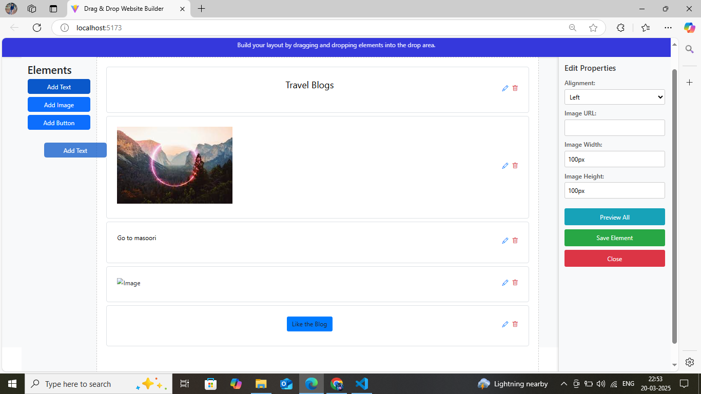

# Website Layout Builder

A drag-and-drop website layout builder built with **React** and **Vite**. This tool allows users to create custom layouts by dragging and dropping elements like text, images, and buttons. Users can also edit properties of these elements and preview the final layout.

## Features

- **Drag-and-Drop Interface**: Easily add elements like text, images, and buttons to the layout.
- **Edit Properties**: Customize element properties such as text content, font size, color, alignment, image URL, button text, and more.
- **Preview Mode**: Preview the final layout before saving.
- **Save Layout**: Save the layout and clear the workspace.
- **Responsive Design**: Works seamlessly on different screen sizes.

## Technologies Used

- **React**: A JavaScript library for building user interfaces.
- **Vite**: A fast build tool for modern web development.
- **Context API**: For state management across components.
- **CSS Modules**: For scoped and modular styling.
- **Bootstrap**: For pre-built UI components and responsive design.
- **dnd-kit**: A modern drag-and-drop library for React.

## Live Demo

Check out the live demo of the project:  
👉 [Live Demo](https://abhishekahirwar01.github.io/website-layout-builder)

---

## Screenshot

Here's a quick look at the project:



_Drag-and-drop interface for creating custom layouts._

---

## Installation and Run

Follow these steps to set up the project locally:

1. **Clone the repository**:
   ```bash
   git clone https://github.com/abhishekahirwar01/website-layout-builder.git
   ```
2. **Navigate to the project directory**:
   ```bash
   cd website-layout-builder
   ```
3. **Install dependencies**:
   ```bash
   npm install
   ```
4. **Run the development server**:
   ```bash
   npm run dev
   ```


